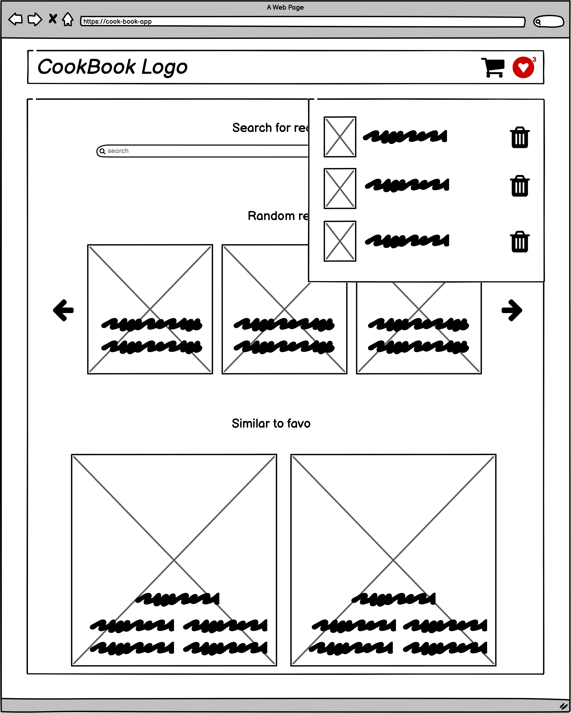
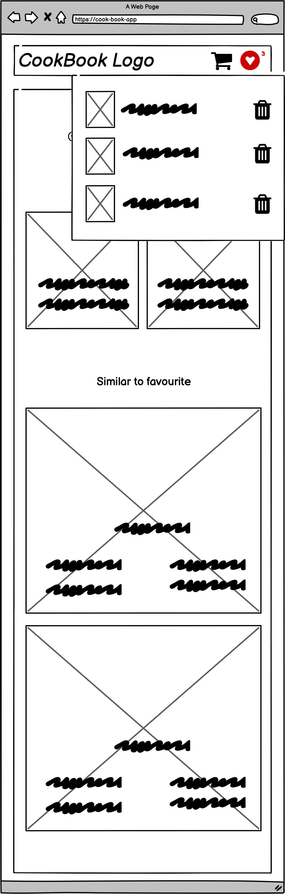
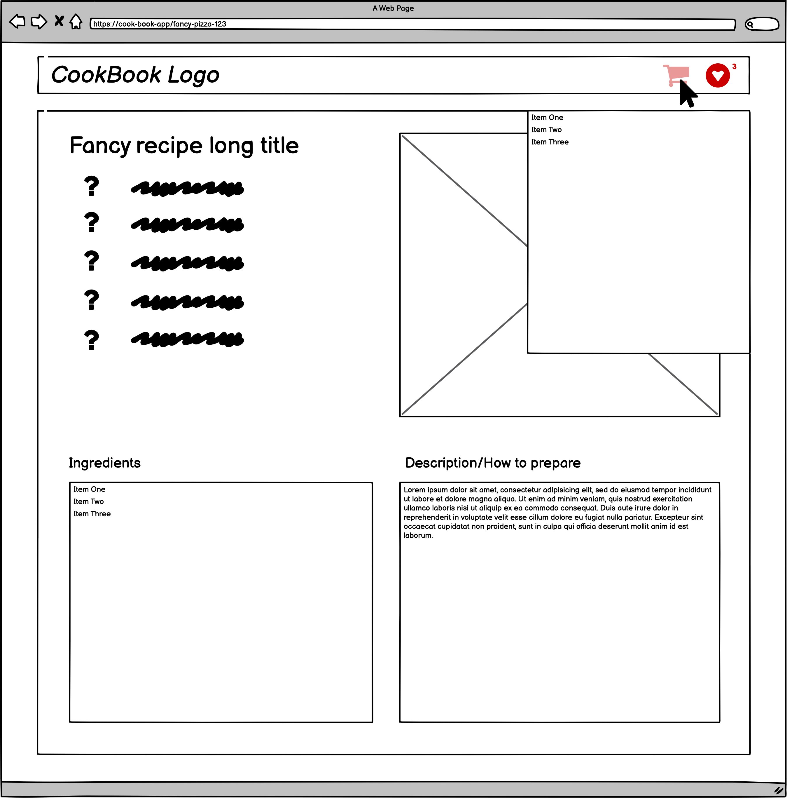
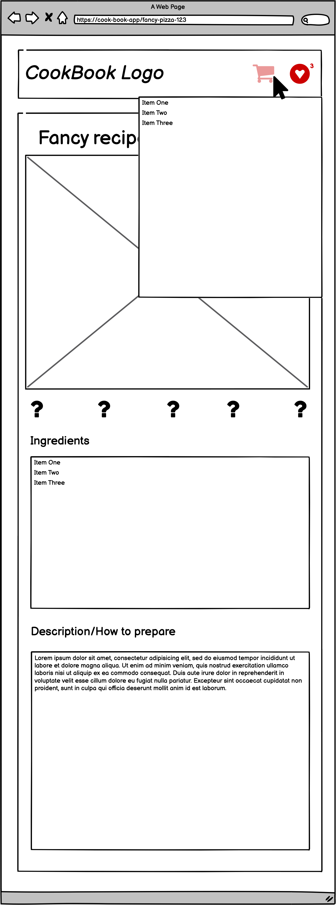

# Cook-Book-App

This simple Cook-Book application will be using the spoonacular API. It will include the following functionalities:

- searching for recipies
- viewing recipe details
- saving recipie to Favourite List
- creating an editable shopping list based on items selected from recipe
 
 

---

## Designs

The main page will be developed based on the wireframes below - Desktop/Tablet/Mobile respectively:

 
 

The recipe page will be developed based on the wireframes below - Desktop and Tablet/Mobile respectively:

 
 

---

This application is created to learn the technologies listed below:

- create-react-app;
- React v17
- TypeScript
- React Context with Hooks for state management
- Routing handled by react-router-dom
- Emotion for styling (Styled Components approach)
- Jest & React Testing Library for unit/integration tests
- axios
